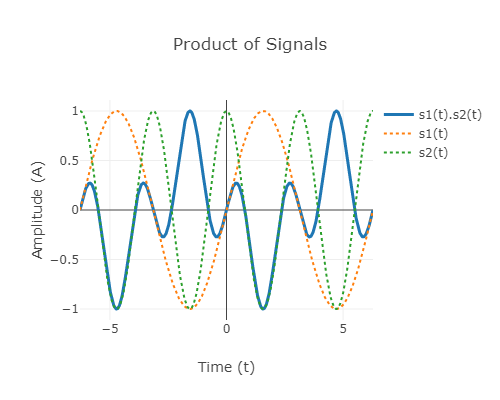
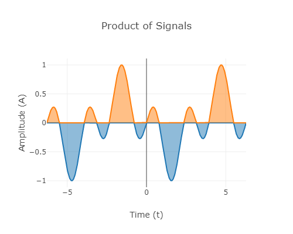
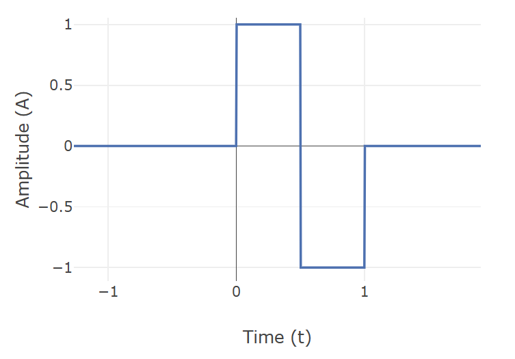
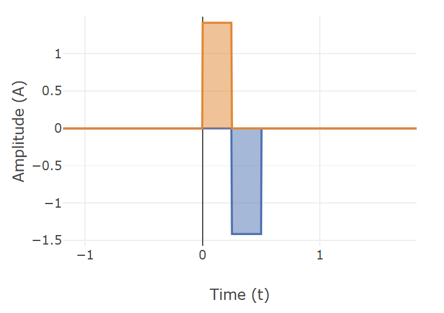

# Theory # 

## Vectors and dot products  ##
To understand orthogonality of signals, we recall the familiar notion of vectors in 3D space and their representation. If $\textbf{i}$, $\textbf{j}$, and $\textbf{k}$ denote the unit vectors along the three perpendicular axes of the reference coordinate system, any arbitrary vector $\textbf{v}$ can be represented as 

$$ \textbf{v} = a \textbf{i} + b \textbf{j} + c \textbf{k} $$ 

In the Cartesian coordinate system, the unit vectors $\textbf{i}, \textbf{j},$ and $\textbf{k}$ correspond to the points (1,0,0), (0,1,0), and (0,0,1) respectively. The dot product of any two vectors $\textbf{v}_1 = (a_1,b_1,c_1)$ and $\textbf{v}_2 = (a_2,b_2,c_2)$ is defined as 

$$\langle\textbf{v}_1,\textbf{v}_2\rangle = \textbf{v}_1 \cdot \textbf{v}_2 = a_1a_2 + b_1b_2 + c_1c_2 $$

By this definition, we can see that any two vectors from the set {$\textbf{i, j, k}$} have zero dot product. In general, any two perpendicular vectors will have zero dot product and are said to be orthogonal to each other. Additionally, when orthogonal unit vectors are used as basis to represent vectors, the coefficients can be easily found. For example, when {$\textbf{i, j, k}$} are used as basis,  

$$ a = \textbf{v} \cdot \textbf{i},  \quad b = \textbf{v} \cdot \textbf{j}, \quad c = \textbf{v} \cdot \textbf{k} $$
 
 ## Dot product of signals and orthogonality ##
In an analogous way, we can generalize and define the notion of dot product (and hence orthogonality) for signals. Signals can be thought of as vectors with infinite dimension. For continuous-time signals $\textbf{x}_1(t)$ and $\textbf{x}_2(t)$ , their dot product is defined as 

 $$ \langle\textbf{x}_1(t),\textbf{x}_2(t)\rangle~ = \int_{t=-\infty}^{t=\infty} \textbf{x}_1(t) \textbf{x}_2(t) dt $$

Two signals $\textbf{x}_1(t)$ and $\textbf{x}_2(t)$ are said to be orthogonal if their dot product, as defined above, is zero, i.e., $\langle\textbf{x}_1(t),\textbf{x}_2(t)\rangle ~= 0$. In other words, the product signal $\textbf{y}(t) = \textbf{x}_1(t) \textbf{x}_2(t)$ has equal amount of positive and negative area.  

For periodic signals $\textbf{x}_1(t)$ and $\textbf{x}_2(t)$ with same period T, their orthogonality can be verified by computing the integral of the product within a single period T. Thus, periodic signals $\textbf{x}_1(t)$ and $\textbf{x}_2(t)$ with period T are orthogonal if 

$$ \langle\textbf{x}_1(t),\textbf{x}_2(t)\rangle~ = \int_{t=0}^{t=T} \textbf{x}_1(t) \textbf{x}_2(t) dt = 0 $$

As an example, consider the signals $\textbf{x}_1(t) = \sin(2\pi t)$ and $\textbf{x}_2(t) = \cos (4\pi t)$. We can easily verify that their dot product is zero as seen by the product signal below 

 &nbsp&nbsp&nbsp&nbsp 

The notion of dot product and orthogonality can be extended to complex signals. If $\textbf{x}_1(t)$ and $\textbf{x}_2(t)$ are periodic complex-valued signals, their dot product is defined as 

$$ \langle\textbf{x}_1(t),\textbf{x}_2(t)\rangle ~= \int_{t=-\infty}^{t=\infty} \textbf{x}_1^{*}(t) \textbf{x}_2(t) dt $$

where $\textbf{x}_1^{*}(t)$ denotes complex conjugate of $\textbf{x}_1(t)$. For example, the signals $e^{j \pi t}$ and $e^{j 2\pi t}$ are orthogonal signals. 
 
 ## Discrete-time signals ##

In a similar fashion, for discrete-time signals, dot product can be defined as 

$$ \langle\textbf{x}_1[n],\textbf{x}_2[n]\rangle ~= \sum_{n=-\infty}^{n=\infty} \textbf{x}_1[n] \textbf{x}_2[n]$$ 

For finite $N$-length signals, dot product can be defined as 

$$\langle\textbf{x}_1[n],\textbf{x}_2[n]\rangle ~= \sum_{n=0}^{n=N-1} \textbf{x}_1[n] \textbf{x}_2[n]$$

## Fourier Series ##

As in vectors, orthogonal signals are extensively used in representation of signals. Very often, they form the building blocks for various ways of signal representation. For example, in Fourier series analysis, a periodic signal is represented using sinusoids as follows: 

$$ \textbf{x}(t) = a_0 + a_k \cos(2\pi k f_0 t) + b_k \sin(2\pi k f_0 t),$$ 

where $T = \frac{1}{f_0}$ is the period of $\textbf{x}(t)$. The set of signals $\{1, \cos(2\pi k f_0 t), \sin(2\pi k f_0 t)\}$ are the building blocks in Fourier series representation of periodic signals, where $1$ denotes the constant signal. All the signals in this set have the common period of $T$. We can verify that any two signals in this set are orthogonal. Above is the trigonometric Fourier series representation. 

## Haar Wavelet ##

Orthogonality is a recurring feature of many other signal representations, for example wavelet decomposition. In wavelet theory, a mother wavelet function is used to generate the building blocks by performing scaling and translation of this function. The set of functions (wavelets) thus generated form a pairwise orthogonal set of signals. These building blocks can be used to represent any continuous real function with finite support. 

As an example, consider the [Haar mother wavelet](https://en.wikipedia.org/wiki/Haar_wavelet#:~:text=In%20mathematics%2C%20the%20Haar%20wavelet,terms%20of%20an%20orthonormal%20basis.) and its scaled and translated version with scale factor n and shift k given by,  

$$ \psi(t) = \left\{\begin{matrix}
1 \quad 0\leqslant t < \frac{1}{2}\\ 
-1 \quad \frac{1}{2}\leqslant t < 1\\ 
0 \quad \text{otherwise.}
\end{matrix}\right.$$

$$\psi _{n,k}(t)=2^{n/2}\psi (2^{n}t-k),\quad t\in \mathbb {R}.$$

We can verify that the scaled and shift versions of the Haar wavelet are orthogonal to each other. As a special case, orthogonality of the scaled wavelets $\phi_1(t)$ and $\phi_2(t)$ can be seen below, 

## Advantages of orthogonality ##
 Finding the coefficients becomes easy when a signal is decomposed into a set of orthogonal signals. Consider the trigonometric Fourier series representation given above. We can find the coefficients $\{a_0, a_k, b_k\}$ by computing the dot product of the given periodic signal $\textbf{x}(t)$ with the signal associated with each of these components. Thus 

$$ A_0 ~= \frac{1}{\pi} \int_{-\pi}^{\pi} \textbf{x}(t)~ dt $$

$$ A_k ~= \frac{1}{\pi} \int_{-\pi}^{\pi} \textbf{x}(t) \cos(kt)~ dt $$

$$ B_k ~= \frac{1}{\pi} \int_{-\pi}^{\pi} \textbf{x}(t) \sin(kt)~ dt $$

Coefficients in other signal representations can be obtained in a similar way.  
